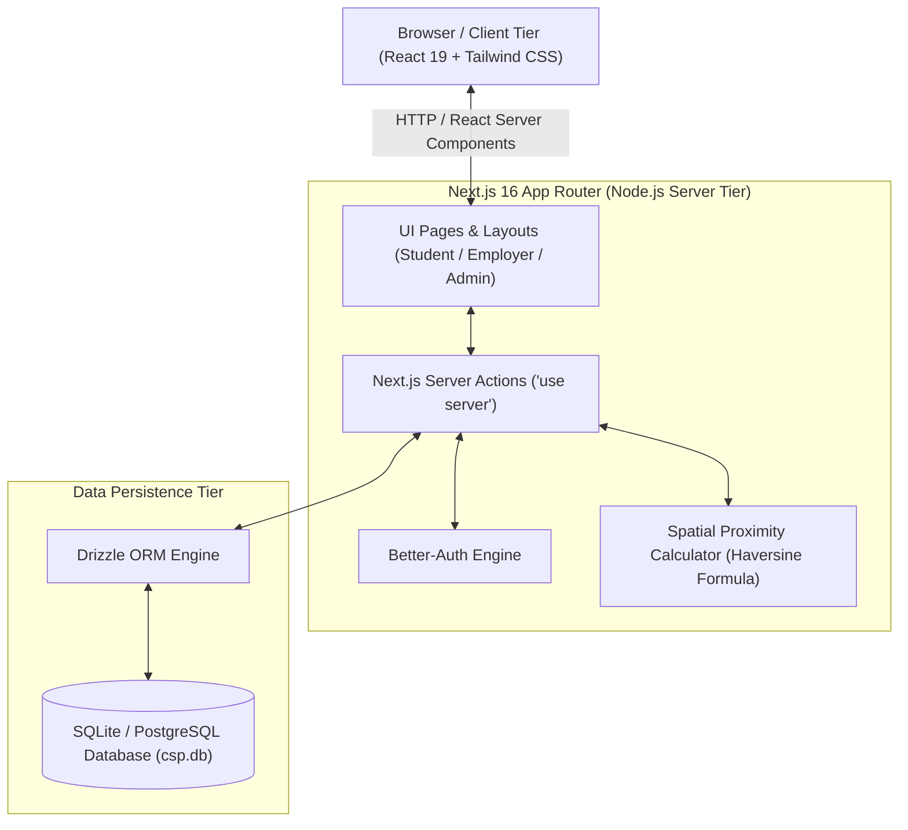
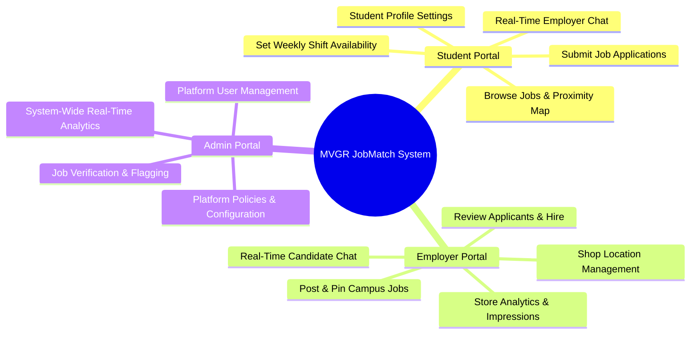
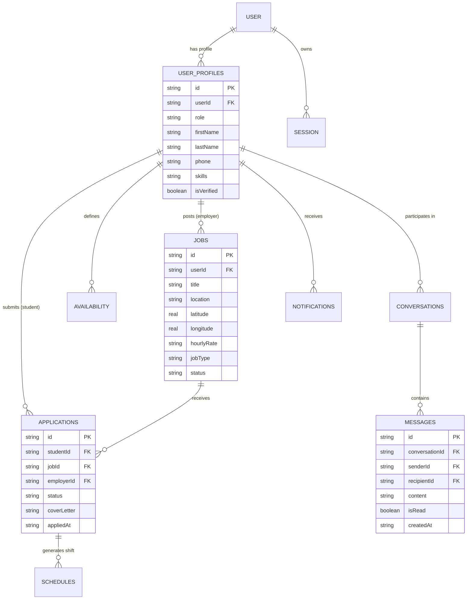
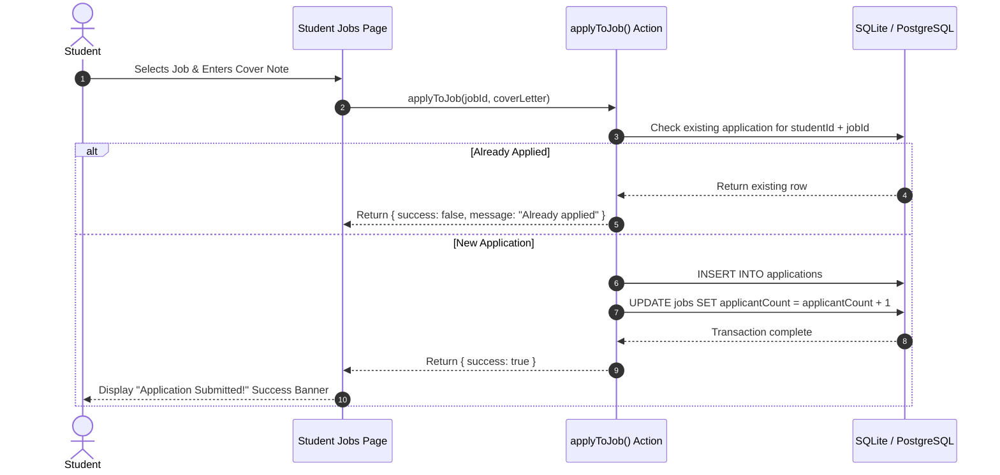
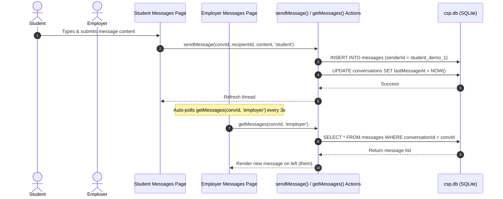

# MVGR JobMatch - System Architecture Plan

## 1. Executive Summary

**MVGR JobMatch** is a dedicated campus job discovery and recruitment platform designed for **MVGR College of Engineering, Vizianagaram**. The platform bridges the gap between engineering students looking for flexible part-time/contract work and campus partners (hostel canteens, central library, printing/xerox stores, coding lab assistants, and local businesses).

The platform features role-tailored dashboards for **Students**, **Employers**, and **System Administrators**, powered by real-time spatial geo-proximity mapping, database-driven server actions, and direct bi-directional chat messaging.

---

## 2. High-Level Architecture Overview

---

## 3. Technology Stack & Layering

| Layer | Technologies | Responsibility |
|---|---|---|
| **Frontend Tier** | Next.js 16 (App Router), React 19, Tailwind CSS v4, Lucide React | Modern responsive UI, glassmorphism design, client state management, interactive Leaflet maps |
| **Server Tier** | Next.js Server Actions (`app/actions/*`), Node.js | Secure server-side business logic, database mutations, role permissions |
| **Authentication** | Better-Auth with Drizzle Adapter | Session management, role fallback validation, secure cookie attributes |
| **Spatial / Mapping** | Leaflet & React-Leaflet, Haversine Math Utility | Dynamic coordinate calculation relative to MVGR Hostel (18.0601° N, 83.4005° E) |
| **ORM & Database** | Drizzle ORM (`drizzle-orm/better-sqlite3`), SQLite (`csp.db`) / PostgreSQL | Type-safe schema definition, transactional persistence, database migrations |
| **Analytics Engine** | Recharts, Custom SQL Aggregations | Dynamic graphical metrics for applicants, job types, and conversion rates |

---

## 4. Subsystems & Role-Based Portals

### 4.1. Student Portal (`/student/*`)
- **Job Discovery & Proximity**: Interactive Leaflet map rendering registered shops within a dynamic kilometer radius of the MVGR Hostel.
- **My Applications**: Track status (`pending`, `reviewed`, `accepted`, `rejected`, `withdrawn`) of submitted applications.
- **My Schedule**: Visual 7-day grid to define shift availability slots and export confirmed shifts to `.ics` calendar files.
- **Messaging**: Direct 3-second live auto-polling chat thread with store managers.

### 4.2. Employer Portal (`/employer/*`)
- **My Jobs**: Create new job postings with exact campus map coordinates (latitude/longitude), hourly pay rate (`₹`), and required skill tags.
- **Applicants**: Review cover notes, inspect student profiles, and update hiring statuses (`Hire`, `Decline`).
- **Analytics**: Graphic breakdown of store map impressions, applicant conversion rates, and weekly application trends via Recharts.
- **Messaging**: Dedicated chat interface to converse with applicants.

### 4.3. Admin Portal (`/admin/*`)
- **User Management**: View, verify/unverify, create, or soft-delete student, employer, and admin accounts.
- **Job Moderation**: Audit active campus job postings, flag inappropriate listings, or approve pending roles.
- **Analytics**: System-wide distribution of user roles, employment categories, and hiring metrics.

---

## 5. Entity Relationship Diagram (ERD)

---

## 6. Key Data Pipelines

### 6.1. Job Application Workflow

### 6.2. Live Bi-Directional Messaging Pipeline

---

## 7. Security, Environment & Portability

- **Environment Configuration**: Key settings are defined in `.env.local` (`DATABASE_URL`, `BETTER_AUTH_SECRET`, `BETTER_AUTH_URL`).
- **Database Flexibility**: Uses **Drizzle ORM**, allowing zero-config local execution using **SQLite** (`better-sqlite3`, `csp.db`) while supporting seamless migration to **PostgreSQL** by switching the dialect driver.
- **Input & Type Validation**: Strict TypeScript types enforced across server actions and component props (`npx tsc --noEmit` clean).
